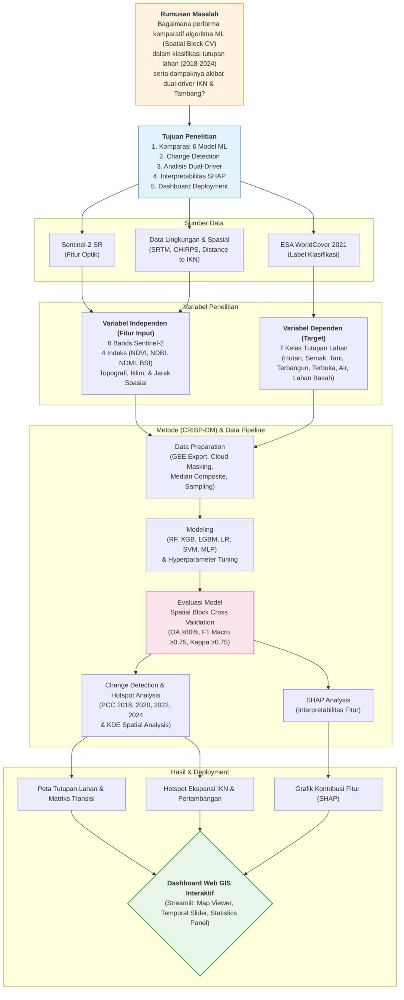

# Flowchart Alur Penelitian

Berikut adalah visualisasi alur penelitian Anda berdasarkan kode Mermaid yang diberikan:

> **Tips:** Anda dapat mengambil screenshot (*screen capture*) dari diagram di atas untuk disisipkan ke dalam laporan proposal atau presentasi PowerPoint Anda.
