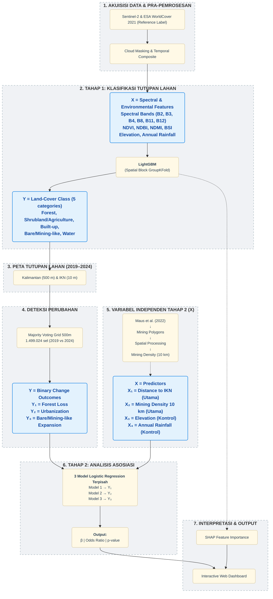

# Flowchart & Narasi Alur Penelitian

Dokumen ini memuat audit komprehensif dari seluruh *pipeline* penelitian Anda dari hulu (Google Earth Engine) hingga hilir (Dashboard Web). Gunakan dokumen ini sebagai acuan utama untuk menyusun narasi Bab Metodologi (Bab 2) dan lampiran teknis presentasi.

---

## 1. Diagram Metodologi (Figure 1)

Berikut adalah diagram alir penelitian yang dirancang dengan gaya visual *scientific workflow* (publikasi jurnal internasional):

---

## 2. Narasi Alur (*The Storyline*)

Penelitian ini dibagi menjadi beberapa tahapan komputasi utama yang saling berkesinambungan:

### Tahap 1 & 2: Akuisisi Data & Pra-pemrosesan
Proses dimulai di *cloud* GEE untuk menghindari *download* citra bergiga-giga. Kita menggunakan citra **Sentinel-2** (komposit median tahunan 2019-2024) untuk mendapatkan fitur spektral (B2, B3, B4, NIR, SWIR, NDVI, dll). Sebagai *Reference Label*, kita memakai **ESA WorldCover 2021** yang disederhanakan menjadi **5 Kelas Utama**: *Forest, Shrubland/Agriculture, Built-up, Bare/Mining-like, Water*. Selain itu, dihitung pula elevasi, curah hujan, dan jarak ke IKN.

### Tahap 3 & 4: Data Pelatihan & Klasifikasi Terawasi
Dataset 30.000 titik (10 m) diekstrak dan dilatih menggunakan 6 algoritma. Untuk mencegah *spatial autocorrelation leakage*, digunakan metode **Spatial Block GroupKFold**. Seluruh kandidat dioptimasi menggunakan Grid Search, kemudian dievaluasi validasi spasialnya. Hasilnya, **LightGBM** dipilih sebagai model operasional utama.

### Tahap 5: Prediksi Spasial
LightGBM yang sudah terlatih digunakan untuk melakukan prediksi. Proses ini dicabangkan menjadi dua:
- **Makro (Kalimantan):** Prediksi grid 500 m untuk tahun 2019-2024.
- **Mikro (IKN):** Prediksi detail di resolusi asli 10 m khusus radius IKN.

### Tahap 6: Analisis Perubahan Tutupan Lahan
Menggunakan peta prediksi makro, setiap sel grid 500 m didekomposisi menjadi sub-grid 5×5 (25 sub-piksel) dan kelas tutupan lahan ditentukan via **Majority Voting**. Metode ini menghasilkan **1.499.024 sel valid** — 12× lebih banyak dari metode Centroid lama. Melalui perbandingan dua titik waktu (2019 vs 2024), dihasilkan matriks transisi yang mengkuantifikasi parameter utama: *Forest Loss, Urbanization*, dan *Mining Expansion*. Untuk Tahap 3 (Regresi), label Majority Voting di-*downsample* ke grid sistematis 10 km (**122.478 titik**) via *Spatial Intersection* guna menjaga asumsi independensi statistik.

### Tahap 7: Data Tambang Eksternal (Independen)
Secara **terpisah** dari *pipeline* klasifikasi optik, dataset independen poligon tambang aktual dari **Maus et al. (2022)** diproses secara spasial untuk menghasilkan variabel kepadatan tambang (*Mining Density 10 km*).

### Tahap 8: Analisis Asosiasi
Digunakan **Multivariate Logistic Regression** untuk menginvestigasi asosiasi antara variabel lingkungan (jarak IKN, kepadatan tambang, dll) terhadap hasil perubahan tutupan lahan. Output yang dianalisis berupa *Odds Ratio* dan *p-value*.

### Tahap 9: Interpretasi & Output
Seluruh hasil dirangkum melalui interpretasi *SHAP Feature Importance*, Peta Perubahan, dan Matriks Transisi, yang semuanya diintegrasikan ke dalam sebuah **Visualisasi / Dashboard Web Interaktif**.
