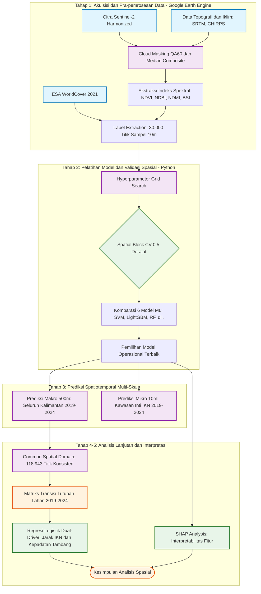

# BAB 2: Materi dan Metode
*(Draf khusus)*

## 2.1 Wilayah Studi

Penelitian ini memfokuskan analisis spasial pada seluruh daratan Pulau Kalimantan, Indonesia. Secara geografis, wilayah studi dibatasi oleh koordinat *bounding box* kira-kira pada bujur 108,5° BT hingga 119,5° BT dan lintang 4,2° LS hingga 4,5° LU. Analisis mencakup lima wilayah administratif tingkat provinsi, yaitu Kalimantan Timur, Kalimantan Selatan, Kalimantan Tengah, Kalimantan Barat, dan Kalimantan Utara.

Selain cakupan makro (seluruh pulau), penelitian ini menetapkan lokus mikro di Kawasan Inti Pusat Pemerintahan (KIPP) Ibu Kota Nusantara (IKN) dengan titik pusat koordinat di 1,128° LS dan 116,847° BT. Guna mengevaluasi sebaran dampak pembangunan IKN terhadap laju deforestasi (*telecoupling effect*), dibentuk zona-zona penyangga (*buffer zones*) spasial dengan radius 10 km, 25 km, 50 km, dan 100 km dari titik pusat IKN. Karakteristik topografi Kalimantan yang bervariasi dari dataran rendah bergambut hingga perbukitan (Diekstrak dari SRTM) memberikan konteks spasial yang kaya untuk memodelkan hambatan geografis terhadap laju ekspansi tutupan lahan.

## 2.2 Metodologi

Penelitian ini menggunakan pendekatan kuantitatif berbasis komputasi spasial yang mengintegrasikan penginderaan jauh (*remote sensing*), algoritma *Machine Learning* (ML), dan pemodelan statistik inferensial. Seluruh tahapan akuisisi data dan prapemrosesan awal dilakukan memanfaatkan arsitektur komputasi awan Google Earth Engine (GEE) (Gorelick et al., 2017), sementara proses pelatihan model, validasi, dan analisis penggerak (*driver analysis*) dieksekusi menggunakan bahasa pemrograman Python. 

Alur kerja (*workflow*) penelitian ini dirancang secara berjenjang dari skala mikro hingga makro, dan dapat diklasifikasikan ke dalam lima tahapan utama: (1) Akuisisi dan Pra-pemrosesan Data, (2) Pelatihan Model dan Validasi Spasial, (3) Prediksi Spatiotemporal Multi-Skala, (4) Deteksi Perubahan Lahan, dan (5) Analisis Penggerak Deforestasi dan Interpretabilitas Model. Diagram alir metodologi secara komprehensif disajikan pada **Gambar 2.1**.

### Diagram Alir Penelitian (Kerangka Kerja)

*Gambar 2.1. Diagram Alir Metodologi Penelitian.*

---

### Penjelasan Tahapan Metodologi

#### 1. Akuisisi dan Pra-pemrosesan Data (*Data Engineering*)
Penelitian ini memanfaatkan citra satelit **Sentinel-2 Surface Reflectance (Harmonized)** yang memiliki keunggulan resolusi spasial 10 meter dan kanal *Red-Edge* yang sangat sensitif terhadap kerapatan vegetasi tropis (Phiri et al., 2020). Karakteristik *band* spektral yang digunakan dalam klasifikasi dirangkum pada **Tabel 2.1**.

**Tabel 2.1.** Spesifikasi Spektral Sentinel-2 yang Digunakan
| Band | Keterangan | Panjang Gelombang (nm) | Resolusi Asli |
| :--- | :--- | :--- | :--- |
| B2 | Biru (*Blue*) | 490 | 10 m |
| B3 | Hijau (*Green*) | 560 | 10 m |
| B4 | Merah (*Red*) | 665 | 10 m |
| B8 | Inframerah Dekat (*NIR*) | 842 | 10 m |
| B11 | Inframerah Gelombang Pendek (*SWIR-1*) | 1610 | 20 m (Resampled ke 10m) |
| B12 | Inframerah Gelombang Pendek (*SWIR-2*) | 2190 | 20 m (Resampled ke 10m) |

Untuk meminimalisir gangguan atmosfer dan tutupan awan yang tebal di atas ekuator, dilakukan teknik *Cloud Masking* menggunakan *band* QA60 dan *median temporal compositing* secara tahunan (2019 dan 2024). 
Selain *band* spektral mentah, penelitian ini mensintesis empat indeks turunan utama untuk mempertegas batas piksel vegetasi, tanah, dan bangunan. Keempat indeks tersebut dihitung menggunakan persamaan matematis berikut:

1.  **NDVI (*Normalized Difference Vegetation Index*)**  
    $$ NDVI = \frac{NIR - Red}{NIR + Red} $$
2.  **NDBI (*Normalized Difference Built-up Index*)**  
    $$ NDBI = \frac{SWIR1 - NIR}{SWIR1 + NIR} $$
3.  **NDMI (*Normalized Difference Moisture Index*)**  
    $$ NDMI = \frac{NIR - SWIR1}{NIR + SWIR1} $$
4.  **BSI (*Bare Soil Index*)**  
    $$ BSI = \frac{(SWIR1 + Red) - (NIR + Blue)}{(SWIR1 + Red) + (NIR + Blue)} $$

Untuk kebutuhan pengawasan pembelajaran (*Supervised Learning*), label klasifikasi (*ground truth*) diekstrak dari peta referensi global **ESA WorldCover 2021** yang dimodifikasi menjadi 5 kelas utama proyek (**Tabel 2.2**). Sebanyak 30.000 titik piksel murni berskala 10m ditarik menggunakan metode *Stratified Random Sampling* untuk mendistribusikan representasi kelas secara proporsional.

**Tabel 2.2.** Pemetaan Kelas ESA WorldCover ke Kelas Proyek
| Kelas Asli ESA WorldCover | Kode Kelas Proyek | Deskripsi Kelas Proyek |
| :--- | :---: | :--- |
| *Tree cover, Mangroves, Wetlands* | 0 | **Forest** (Hutan/Vegetasi Lebat) |
| *Shrubland, Grassland, Cropland, Moss* | 1 | **Shrubland/Agriculture** (Semak/Pertanian) |
| *Built-up* | 2 | **Built-up** (Area Terbangun/Infrastruktur) |
| *Bare / sparse vegetation* | 3 | **Bare/Mining-like** (Tanah Terbuka/Tambang) |
| *Permanent water bodies* | 4 | **Water** (Badan Air) |

#### 2. Validasi Spasial dan Pemilihan Model (*Machine Learning Modeling*)
Berbeda dengan pendekatan klasifikasi tabular konvensional yang mengandalkan pemisahan acak (*random split*), penelitian ini mengimplementasikan **Spatial Block GroupKFold Cross-Validation (0.5 derajat)**. Pendekatan ini merupakan standar emas (*gold standard*) dalam ekologi kuantitatif guna mencegah kebocoran data spasial (*spatial data leakage*) akibat Hukum Geografi Pertama Tobler tentang autokorelasi spasial (Roberts et al., 2017; Ploton et al., 2020).
Sebanyak enam algoritma diuji secara kompetitif (SVM, LightGBM, XGBoost, *Random Forest*, *Multi-Layer Perceptron*, dan Regresi Logistik). Pemilihan model akhir (*operational model*) tidak hanya didasarkan pada metrik performa absolut (seperti *Overall Accuracy* dan *Macro F1-Score*), melainkan juga mempertimbangkan efisiensi komputasi waktu prediksi, di mana algoritma berbasis *Gradient Boosting* (seperti LightGBM) terbukti menawarkan *trade-off* terbaik untuk pemrosesan skala benua/pulau.

#### 3. Prediksi Spatiotemporal Multi-Skala
Guna mengatasi dilema antara presisi spasial dan batasan memori komputasi (Wu, 2004), tahap prediksi dipecah menjadi dua skala resolusi:
*   **Prediksi Makro (500m):** Dilakukan untuk seluruh daratan Pulau Kalimantan (sekitar 73 juta hektar) guna memfasilitasi analisis tren statistik deforestasi lintas batas provinsi (*telecoupling*).
*   **Prediksi Mikro (10m):** Diterapkan secara eksklusif pada Kawasan Inti Pusat Pemerintahan (KIPP) IKN untuk membuktikan presisi asli model tanpa pengaruh *mixed pixels*, sekaligus memvalidasi ekspansi infrastruktur skala lokal.

#### 4. Deteksi Perubahan dan Konsep *Common Domain*
Deteksi perubahan lahan dari 2019 hingga 2024 tidak dilakukan menggunakan pengurangan sederhana, melainkan menggunakan filter **Common Spatial Domain**. Konsep ini hanya menganalisis 118.943 titik grid yang secara konsisten terbebas dari tutupan awan di kedua tahun pengamatan (2019 dan 2024). Metode ini mereduksi potensi *false-positive* yang sering terjadi akibat variasi musim atau residu bayangan awan (Habibie et al., 2025).

#### 5. Analisis Penggerak (*Drivers*) dan SHAP *Explainability*
Tahap akhir metodologi berfokus pada inferensia asosiasi spasial. Untuk menganalisis faktor penggerak transisi lahan, diaplikasikan **Regresi Logistik Multivariat** guna menghitung log-odds probabilitas deforestasi, urbanisasi, maupun ekspansi tambang. Persamaan regresi logistik dirumuskan secara umum sebagai:

$$ \ln \left( \frac{P(Y=1)}{1 - P(Y=1)} \right) = \beta_0 + \beta_1(Dist_{IKN}) + \beta_2(Dens_{Mining}) + \beta_3(Elev) + \epsilon $$

*Di mana $P(Y=1)$ adalah probabilitas terjadinya deforestasi, $\beta$ adalah koefisien variabel independen (Jarak IKN, Kepadatan Tambang, Elevasi), dan $\epsilon$ adalah galat sisa (Meyfroidt et al., 2014).*

Selain itu, penelitian ini membongkar sifat "kotak hitam" (*black-box*) dari model *Machine Learning* menggunakan pendekatan **SHAP (SHapley Additive exPlanations)**. Analisis SHAP menghitung kontribusi marjinal dari setiap fitur secara individual menggunakan fungsi penjelasan linear:

$$ g(z') = \phi_0 + \sum_{j=1}^{M} \phi_j z'_j $$

*Di mana $g(z')$ adalah model penjelas, $M$ adalah jumlah fitur, dan $\phi_j$ adalah nilai kontribusi Shapley untuk fitur ke-$j$ (Lundberg & Lee, 2017). Pendekatan matematis ini memastikan bahwa arah keputusan algoritma sejalan dengan hukum ekologi dan fisika optik.*

## 2.3 Pengumpulan dan Persiapan Data

### 2.3.1 Data Satelit (Sentinel-2)
Penelitian ini memanfaatkan citra satelit **Sentinel-2 Surface Reflectance (SR) Harmonized** yang diakses melalui portal komputasi awan Google Earth Engine (GEE). Satelit Sentinel-2, yang dioperasikan di bawah Program Copernicus oleh *European Space Agency* (ESA), dipilih karena memiliki resolusi spasial tinggi (10 meter) dan waktu kunjungan ulang (*revisit time*) yang sangat singkat, yakni sekitar 5 hari. Hal ini menjadikannya sangat ideal untuk memantau dinamika tutupan lahan di wilayah ekuator yang cepat berubah (Phiri et al., 2020; Karra et al., 2021). 
Pada penelitian ini, digunakan enam *band* spektral utama: *Band* 2 (Biru), 3 (Hijau), 4 (Merah), dan 8 (NIR) dengan resolusi asli 10m, serta *Band* 11 (SWIR-1) dan 12 (SWIR-2) yang di-*resample* menjadi 10m. Guna mengatasi tingginya frekuensi tutupan awan di atas Pulau Kalimantan, diterapkan proses *cloud masking* berbasis *band* QA60 (ambang batas awan 20%) yang dikombinasikan dengan pembentukan komposit median temporal (*median temporal compositing*) tahunan untuk periode pengamatan 2018–2024.

### 2.3.2 Data Topografi dan Lingkungan
Selain fitur spektral optik, pemodelan penggerak spasial (*spatial driver analysis*) menuntut integrasi data topografi dan iklim untuk mengukur kerentanan dan probabilitas perubahan lahan.
1. **Elevasi (Topografi):** Data model elevasi digital (DEM) diekstrak dari instrumen ***Shuttle Radar Topography Mission* (SRTM)** versi 3 (SRTMGL1_003) beresolusi 30 meter. Topografi dan kemiringan lereng memainkan peranan krusial dalam menentukan hambatan fisik bagi ekspansi infrastruktur maupun pertambangan, sekaligus kerentanan area hutan terhadap perambahan (Farr et al., 2007).
2. **Curah Hujan (Iklim):** Parameter curah hujan tahunan (mm/tahun) diakuisisi dari dataset ***Climate Hazards Group InfraRed Precipitation with Station data* (CHIRPS)**. CHIRPS sangat direkomendasikan untuk wilayah tropis karena menggabungkan klimatologi inframerah satelit dengan observasi stasiun cuaca, menghasilkan estimasi curah hujan beresolusi tinggi (0,05 derajat) yang andal meskipun pada wilayah dengan kepadatan stasiun yang rendah (Funk et al., 2015).
### 2.3.3 Indeks Lingkungan
Proses rekayasa fitur (*feature engineering*) diperkuat dengan ekstraksi empat indeks spektral turunan. Transformasi matematis dari reflektansi *band* ini dirancang untuk memaksimalkan sensitivitas model *Machine Learning* terhadap kelas tutupan lahan spesifik:
1. **NDVI (*Normalized Difference Vegetation Index*):** Dihitung berdasarkan selisih ternormalisasi antara *band* NIR dan Merah. NDVI secara universal diakui sebagai indikator utama kerapatan, kesehatan, dan biomassa vegetasi (Rouse et al., 1974). Analisis SHAP (*SHapley Additive exPlanations*) pada model *LightGBM* mengonfirmasi bahwa NDVI adalah fitur prediktor paling dominan dalam memisahkan hutan dari area non-vegetasi.
2. **NDBI (*Normalized Difference Built-up Index*):** Mengandalkan rasio *band* SWIR-1 dan NIR. Indeks ini diekstraksi secara khusus untuk memisahkan area terbangun (beton, aspal, infrastruktur IKN) dari tanah gundul alami, karena area terbangun cenderung memiliki reflektansi SWIR yang lebih tinggi dibandingkan NIR (Zha et al., 2003).
3. **NDMI (*Normalized Difference Moisture Index*):** Turunan dari *band* NIR dan SWIR-1 yang sensitif terhadap kandungan air pada kanopi vegetasi (Gao, 1996). 
*(Catatan Metodologis: Dalam formulasi proyek ini, formula nilai NDMI merupakan negasi matematis dari NDBI, yang menghasilkan redundansi (korelasi -1.0). Meskipun algoritma ensemble berbasis pohon (tree-based) secara umum kebal terhadap multikolinearitas ini, keberadaannya secara sengaja didokumentasikan sebagai bentuk transparansi).*
4. **BSI (*Bare Soil Index*):** Indeks kompleks yang mengintegrasikan *band* Biru, Merah, NIR, dan SWIR-1. BSI diimplementasikan untuk meningkatkan deteksi pemukaan tanah terbuka, area galian tambang, dan area deforestasi segar yang belum tertutup semak belukar (Rikimaru et al., 2002).

### 2.3.4 ESA WorldCover
Sistem pembelajaran mesin tersupervisi (*supervised learning*) membutuhkan label kebenaran dasar (*ground truth*) berkualitas tinggi. Dataset referensi yang digunakan adalah **ESA WorldCover 10m 2021 v200**, yang diakui luas sebagai salah satu peta tutupan lahan global beresolusi 10 meter yang mutakhir dan akurat (Zanaga et al., 2022). 
Data WorldCover yang semula terdiri dari 11 kelas direklasifikasi menjadi 5 kelas utama yang difokuskan pada bentang ekosistem Kalimantan: (0) *Forest*, (1) *Shrubland/Agriculture*, (2) *Built-up*, (3) *Bare/Mining-like*, dan (4) *Water*. Tahap prapemrosesan akhir melibatkan penyusunan dataset sampel yang memuat 30.000 titik (piksel) berskala 10 meter. Titik-titik sampel ini diekstraksi dengan teknik *Stratified Random Sampling*, di mana dilakukan *oversampling* secara terencana pada kelas-kelas lahan yang secara alamiah minoritas (seperti *Built-up* dialokasikan 5.000 titik dan *Bare/Mining-like* 3.000 titik). Hal ini dirancang untuk meminimalisasi ketidakseimbangan representasi kelas (*class imbalance*), yang umum memicu distorsi performa klasifikasi pada model *Machine Learning*.

## 2.4 Pemrosesan dan Ekspor Data

Pemrosesan awal (*preprocessing*) dilakukan secara paralel pada platform Google Earth Engine (GEE) dan lingkungan komputasi lokal berbasis Python. Proses ini mencakup reduksi spasial, penyelarasan resolusi, dan standarisasi fitur untuk memastikan data mentah siap dikonsumsi oleh algoritma *Machine Learning*.

### 2.4.1 Masking Awan dan Komposit Temporal
Citra Sentinel-2 pada wilayah ekuator memiliki probabilitas tutupan awan (*cloud cover*) yang sangat tinggi secara persisten. Oleh karena itu, diterapkan algoritma *cloud masking* menggunakan informasi kualitas spasial dari *band* QA60 (Gorelick et al., 2017). Bit 10 (mendeskripsikan awan tebal non-transparan) dan Bit 11 (mendeskripsikan awan *cirrus*) pada *band* QA60 digunakan untuk mengeksklusi piksel yang terkontaminasi awan. Selanjutnya, diaplikasikan operasi *median temporal compositing* untuk mereduksi deret waktu (*time-series*) citra harian dalam satu tahun kalender menjadi satu citra komposit tunggal. Metode median secara matematis lebih tangguh (*robust*) terhadap nilai pencilan (bayangan awan atau anomali sensor) dibandingkan perhitungan nilai rata-rata (mean).

### 2.4.2 Resolusi Multi-Skala dan Pergeseran Domain (*Domain Shift*)
Desain arsitektur pengolahan spasial pada penelitian ini secara intensional mengimplementasikan dua skala spasial berbeda (Wu, 2004) antara tahap kalibrasi model dan tahap prediksi makro:
1. **Skala Pelatihan (10 meter):** Sebanyak 30.000 titik sampel diekstrak tepat pada resolusi spasial asli optik (10m). Hal ini mutlak diperlukan untuk menangkap probabilitas *pure pixels* (piksel murni) tertinggi, guna menghindari kontaminasi kelas saat model sedang mempelajari batas (*decision boundary*) fitur spektral.
2. **Skala Prediksi Makro (500 meter):** Guna memetakan dinamika lanskap seluruh Pulau Kalimantan secara temporal (2018–2024), resolusi direduksi (*spatial aggregation*) menggunakan fungsi median *reducer* ke skala 500m. Ini adalah kompromi (*trade-off*) yang diwajibkan oleh batasan *Random Access Memory* (RAM) pada komputasi lokal saat melakukan inferensi di atas puluhan juta titik koordinat.

Konsekuensi struktural dari perbedaan resolusi ini adalah timbulnya **Pergeseran Domain** (*Domain Shift*). Agregasi 500m secara fundamental menghaluskan varians lokal. Hal ini mengakibatkan model (yang dilatih pada varians tinggi 10m) berpotensi mengalami sedikit bias probabilitas terhadap kelas dominan seperti Hutan dan menurunkan estimasi luas area kelas minoritas yang berstruktur geometris kecil seperti Area Terbangun (*Built-up*). Dalam literatur *Remote Sensing*, fenomena ini diakui sebagai disonansi resolusi lintas domain (Tuia et al., 2016). Fenomena keterbatasan resolusi ini secara transparan didokumentasikan sebagai bagian dari batasan arsitektur makro klasifikasi ini.

### 2.4.3 Ekspor Data
Data tabular pelatihan maupun grid prediksi diekspor melalui infrastruktur GEE *Batch Export* ke format *Comma-Separated Values* (CSV). Melalui proses filter kualitas tahunan, teridentifikasi anomali kelengkapan citra pada tahun 2018 (masa awal satelit Sentinel-2B mengorbit). Hal ini berakibat pada penyusutan jumlah titik grid 500m secara ekstrem menjadi hanya 13.632 titik (~7,8% dari tahun komplit 2019). Penurunan volume spasial absolut ini dirangkum pada **Tabel 2.3**.

**Tabel 2.3.** Rekapitulasi Dimensi Data Grid Prediksi (Resolusi 500m)
| Tahun Pengamatan | Total Titik (Piksel) | Persentase Keutuhan Area |
| :---: | :---: | :--- |
| **2018*** | 13.632 | 7,77 % |
| **2019** | 175.384 | 100,0 % (Base) |
| **2020** | 176.624 | 100,7 % |
| **2021** | 162.940 | 92,9 % |
| **2022** | 160.261 | 91,3 % |
| **2023** | 159.949 | 91,1 % |
| **2024** | 154.137 | 87,8 % |
*\*Tahun 2018 mengalami penyusutan grid ekstrem akibat belum lengkapnya jangkauan citra tanpa tutupan awan Sentinel-2.*

### 2.4.4 Standarisasi Fitur
Sebelum data matriks dieksekusi oleh model *Machine Learning* parametrik, seperti *Support Vector Machine* (SVM) dan *Logistic Regression*, seluruh fitur numerik distandarisasi secara independen (*feature scaling*). Metode yang digunakan adalah *Standard Scaler* yang mentransformasi himpunan distribusi data asli ke dalam distribusi skor-*Z* standar dengan rata-rata metrik ($\mu$) berada pada nilai nol, dan simpangan baku atau varians ($\sigma$) bernilai 1,0 (Pedregosa et al., 2011). Formulasi normalisasi didefinisikan secara konvensional sebagai:

$$ z = \frac{x - \mu}{\sigma} $$

*Di mana $x$ merepresentasikan nilai fitur observasi riil (seperti reflektansi Band 4 atau indeks NDVI), $\mu$ merupakan nilai tengah sampel (mean), dan $\sigma$ menunjukkan nilai standar deviasi.* 
Meskipun algoritma *gradient boosting* berbasis pohon (*tree-based*) pada dasarnya bersikap invarian terhadap skala fitur, standarisasi tetap diaplikasikan secara terpusat untuk menjaga keseragaman format (*data alignment*) masukan antar algoritma di dalam eksperimen komparasi kerangka klasifikasi.

## 2.5 Pelatihan Model *Machine Learning* dan Optimasi *Hyperparameter*

Tahap ini merupakan inti dari kerangka klasifikasi tutupan lahan. Enam algoritma *supervised machine learning* dilatih dan dievaluasi secara kompetitif di bawah protokol validasi spasial yang ketat untuk mengidentifikasi model operasional terbaik.

### 2.5.1 Arsitektur Model Klasifikasi
Pemilihan enam algoritma didasarkan pada representasi keluarga (*family*) model yang berbeda secara fundamental, guna menjamin keragaman arsitektur dalam eksperimen komparasi (Talukdar et al., 2020). Keenam model beserta karakteristik paradigmanya dirangkum pada **Tabel 2.4**.

**Tabel 2.4.** Arsitektur Model Klasifikasi yang Digunakan
| No. | Model | Paradigma | Karakteristik Utama | Pustaka Implementasi |
| :---: | :--- | :--- | :--- | :--- |
| 1 | *Logistic Regression* (LogReg) | Linear Diskriminatif | *Baseline* model linear; memodelkan batas keputusan (*decision boundary*) sebagai bidang hiper-linear di ruang fitur | Scikit-learn |
| 2 | *Random Forest* (RF) | *Ensemble Bagging* | Agregasi mayoritas dari ratusan pohon keputusan (*decision tree*) independen yang dilatih pada subsampel bootstrap (Breiman, 2001) | Scikit-learn |
| 3 | *XGBoost* | *Ensemble Sequential Boosting* | Optimasi gradien berurutan dengan regularisasi $L_1$/$L_2$ untuk mencegah *overfitting* (Chen & Guestrin, 2016) | XGBoost |
| 4 | *LightGBM* | *Ensemble Sequential Boosting* | Varian *gradient boosting* yang menggunakan *Gradient-based One-Side Sampling* (GOSS) dan *Exclusive Feature Bundling* (EFB), menjadikannya sangat efisien pada dataset berukuran besar (Ke et al., 2017) | LightGBM |
| 5 | *Support Vector Machine* (SVM) | *Kernel-based Discriminative* | Mencari bidang *hyperplane* pemisah optimal di ruang fitur dimensi tinggi menggunakan kernel *Radial Basis Function* (RBF) (Cortes & Vapnik, 1995) | Scikit-learn |
| 6 | *Multi-Layer Perceptron* (MLP) | *Neural Network Feedforward* | Jaringan saraf tiruan dua lapis tersembunyi (128-64 neuron) dengan fungsi aktivasi ReLU dan mekanisme *early stopping* | Scikit-learn |

### 2.5.2 Strategi Validasi Spasial: *Spatial Block GroupKFold*
Berbeda dengan pemisahan data acak (*random train-test split*) yang lazim digunakan dalam klasifikasi tabular, data geospasial memiliki karakteristik unik berupa **autokorelasi spasial** — piksel yang berdekatan secara geografis cenderung memiliki nilai fitur spektral yang serupa, sehingga terjadi kebocoran informasi (*data leakage*) antar *fold* jika pemisahan dilakukan secara acak (Roberts et al., 2017; Ploton et al., 2020). 

Untuk mengatasi hal ini, penelitian ini mengimplementasikan protokol **Spatial Block GroupKFold Cross-Validation** dengan langkah-langkah sebagai berikut:
1. **Pembentukan Blok Spasial:** Seluruh wilayah studi Kalimantan dibagi ke dalam blok-blok (*tiles*) spasial berukuran **0,5° × 0,5°** (ekuivalen ~55 km × 55 km pada garis khatulistiwa). Setiap titik sampel diasosiasikan ke blok berdasarkan koordinat geografisnya (`spatial_block_id`).
2. **Pengelompokan pada Fold:** Prosedur `GroupKFold` dari Scikit-learn memastikan bahwa **seluruh titik dalam satu blok spasial selalu berada di fold yang sama** — tidak pernah terpecah antara set pelatihan dan set validasi. Ini menjamin jarak spasial minimal ~55 km antara data pelatihan dan data evaluasi.
3. **Konfigurasi:** Digunakan $K = 5$ *fold* untuk evaluasi final dan $K = 3$ *fold* untuk tahap pencarian *hyperparameter* cepat (*quick search*).

Pendekatan ini secara matematis menjamin bahwa metrik evaluasi mencerminkan kemampuan generalisasi model ke **wilayah yang belum pernah dilihat** (*unseen regions*), bukan sekadar interpolasi piksel tetangga. Hal ini merupakan standar emas (*gold standard*) dalam ekologi kuantitatif dan *remote sensing* (Roberts et al., 2017).

### 2.5.3 Optimasi *Hyperparameter*
Optimasi *hyperparameter* dilaksanakan menggunakan metode *Exhaustive Grid Search* yang dikombinasikan dengan validasi silang spasial 3-*fold* (`GroupKFold`, $K = 3$). Untuk setiap kombinasi parameter pada *grid*, model dilatih pada 2 *fold* dan dievaluasi pada 1 *fold* yang terpisah secara spasial, lalu rata-rata *Overall Accuracy* (OA) dihitung. Kombinasi parameter dengan skor OA tertinggi dipilih sebagai konfigurasi optimal. Ruang pencarian (*search space*) *hyperparameter* untuk setiap model disajikan pada **Tabel 2.5**.

**Tabel 2.5.** Ruang Pencarian *Hyperparameter* per Model
| Model | *Hyperparameter* | Nilai yang Diuji |
| :--- | :--- | :--- |
| LogReg | Regularisasi ($C$) | {0,1; 1; 10} |
| RF | Jumlah pohon (`n_estimators`); Kedalaman (`max_depth`); Daun minimum (`min_samples_leaf`) | {200, 500}; {None, 20}; {1, 2} |
| XGBoost | Jumlah pohon; Kedalaman; *Learning rate* | {200, 500}; {6, 10}; {0,05; 0,1} |
| LightGBM | Jumlah pohon; Kedalaman; *Learning rate* | {200, 500}; {10, 20}; {0,05; 0,1} |
| SVM | Regularisasi ($C$); Kernel | {1, 10}; {RBF} |
| MLP | Arsitektur tersembunyi; *Learning rate* awal | {(128,64), (256,128)}; {0,001; 0,01} |

Setelah konfigurasi optimal ditemukan, model dilatih ulang dan dievaluasi secara final menggunakan **5-*fold* Spatial Block GroupKFold** pada seluruh 30.000 sampel (kecuali MLP yang menggunakan 10.000 sampel). Terakhir, model final dilatih pada **seluruh data** tanpa pemisahan *fold* untuk menghasilkan model operasional yang akan digunakan pada tahap prediksi.

### 2.5.4 Metrik Evaluasi
Performa klasifikasi dievaluasi menggunakan empat metrik komplementer:
1. ***Overall Accuracy* (OA):** Proporsi total piksel yang diklasifikasikan dengan benar terhadap jumlah seluruh piksel.
$$ OA = \frac{\sum_{i=1}^{c} n_{ii}}{N} $$
*Di mana $n_{ii}$ adalah elemen diagonal matriks konfusi (piksel yang benar diklasifikasikan untuk kelas $i$), $c$ adalah jumlah kelas, dan $N$ adalah total piksel.*

2. ***Macro F1-Score*:** Rata-rata aritmatika *F1-Score* seluruh kelas, memberikan bobot yang setara kepada setiap kelas tanpa memandang proporsi populasinya (Sokolova & Lapalme, 2009). Metrik ini sangat penting dalam konteks ketidakseimbangan kelas lahan.
$$ F1_{macro} = \frac{1}{c} \sum_{i=1}^{c} \frac{2 \cdot Precision_i \cdot Recall_i}{Precision_i + Recall_i} $$

3. ***Cohen's Kappa* ($\kappa$):** Mengukur tingkat kesepakatan (*agreement*) klasifikasi setelah memperhitungkan kemungkinan kebenaran secara kebetulan (*chance agreement*) (Cohen, 1960). Interpretasi nilai $\kappa$: 0,61–0,80 = *Substantial*; 0,81–1,00 = *Almost Perfect*.
$$ \kappa = \frac{p_o - p_e}{1 - p_e} $$
*Di mana $p_o$ adalah proporsi kesepakatan observasi (*Overall Accuracy*) dan $p_e$ adalah proporsi kesepakatan acak yang diharapkan.*

4. ***Intersection over Union* (IoU) per Kelas:** Mengukur tumpang tindih (*overlap*) antara prediksi dan kebenaran dasar untuk setiap kelas individual, sangat sensitif terhadap kesalahan spasial baik *false positive* maupun *false negative*.
$$ IoU_i = \frac{TP_i}{TP_i + FP_i + FN_i} $$

Hasil komparasi performa keenam model dan justifikasi pemilihan model operasional disajikan secara lengkap pada **Bab Hasil dan Pembahasan**.

## 2.6 Deteksi Perubahan Temporal dan Analisis Penggerak

### 2.6.1 Konsep *Common Spatial Domain*
Deteksi perubahan lahan dari 2019 hingga 2024 tidak dilakukan melalui pengurangan luasan agregat secara sederhana, melainkan menggunakan filter **Common Spatial Domain**. Konsep ini hanya mengevaluasi 118.943 titik *grid* (resolusi 500 meter) yang secara konsisten terbebas dari gangguan tutupan awan di *kedua* tahun pengamatan awal (2019) dan akhir (2024). Metode interseksi ketat ini memastikan bahwa penyebut (*denominator*) luasan lahan adalah sama di antara tahun-tahun pembanding, sehingga mereduksi *false-positive* semu yang diakibatkan oleh ketiadaan data akibat awan atau anomali musim (Habibie et al., 2025). Berdasarkan domain spasial bersama ini, dihasilkan matriks transisi tutupan lahan yang mendokumentasikan lintasan spesifik perubahan lahan, seperti perpindahan dari Hutan (Kelas 0) menjadi Area Terbangun (Kelas 2).

### 2.6.2 Regresi Logistik *Dual-Driver*
Tahap akhir analisis berfokus pada inferensia asosiasi spasial menggunakan **Regresi Logistik Multivariat**. Pendekatan ini bertujuan untuk menghitung besaran *log-odds* terjadinya tiga fenomena transisi lahan utama: (1) Deforestasi (*Forest Loss*), (2) Urbanisasi (*Urbanization*), dan (3) Ekspansi Tambang (*Mining Expansion*).

Pemodelan ini menggunakan variabel dependen biner ($Y \in \{0, 1\}$) dan mengintegrasikan sekumpulan variabel penggerak (*driver variables*) independen spasial:
- **Jarak ke IKN (`distance_to_ikn`)**: Jarak euklidean titik dari pusat KIPP IKN.
- **Kepadatan Tambang (`mining_density_10km`)**: Persentase luasan area tambang terbuka aktual dalam radius 10 km. Untuk menghindari *circular reasoning* akibat penggunaan proxy, penelitian ini menggunakan dataset independen **"Global polygons of surface mining area v2" (Maus et al., 2022)** yang diinterseksikan dengan titik sampel secara lokal menggunakan analisis geospasial (`geopandas`).
- **Elevasi (`elevation`)**: Elevasi topografis (SRTM).
- **Curah Hujan (`rainfall_annual`)**: Curah hujan tahunan (CHIRPS).

Persamaan probabilitas regresi logistik dirumuskan sebagai:
$$ \ln \left( \frac{P(Y=1)}{1 - P(Y=1)} \right) = \beta_0 + \beta_1(Dist_{IKN}) + \beta_2(Dens_{Mining}) + \beta_3(Elev) + \beta_4(Rain) + \epsilon $$

Sebelum diumpankan ke model regresi, seluruh variabel independen ditransformasi menggunakan *Standard Scaler* untuk memungkinkan komparasi langsung antar nilai koefisien parsial ($\beta$). Tingkat signifikansi statistik dievaluasi melalui uji-*z* dengan ambang batas keandalan 95% ($p < 0,05$).

## 2.7 Analisis SHAP (*SHapley Additive exPlanations*)

Sistem klasifikasi berbasis *gradient boosting ensemble* (seperti LightGBM) sering dikritik sebagai "kotak hitam" (*black box*). Untuk memastikan bahwa kriteria pengambilan keputusan algoritma konsisten secara ilmiah dengan prinsip fisika optik dan ekologi, model dibedah secara komprehensif menggunakan kerangka kerja **SHAP**. 

Algoritma mengimplementasikan `TreeExplainer`, sebuah varian SHAP yang dioptimalkan khusus untuk ensemble pohon keputusan (*decision tree ensemble*), guna menghitung kontribusi marjinal presisi tinggi untuk setiap piksel prediksi. Nilai SHAP mendekomposisi *output* probabilitas logaritma model menjadi jumlahan komponen kontribusi tiap fitur melalui persamaan penjelas linear:
$$ g(z') = \phi_0 + \sum_{j=1}^{M} \phi_j z'_j $$
*Di mana $g(z')$ mewakili model penjelasan aditif, $M$ adalah total jumlah fitur masukan (misal, 10 fitur spektral), dan $\phi_j$ mewakili kontribusi Shapley dari masing-masing komponen spektral ke-$j$ untuk klasifikasi spesifik.*

Eksperimen ini mengekstrak skor rata-rata *absolute* nilai SHAP secara global maupun spesifik per kelas. Pemetaan SHAP per kelas akan memverifikasi, misalnya, apakah model benar-benar menggunakan indeks NDVI sebagai alasan utama memprediksi sebuah piksel sebagai Kelas "Hutan", dan apakah algoritma menggunakan NDBI saat mendeteksi "Area Terbangun". Analisis transparan ini memvalidasi keandalan fisis model operasional di luar metrik akurasi murni (Lundberg & Lee, 2017).

## 2.8 Jadwal Penelitian

Kegiatan penelitian direncanakan dan dieksekusi secara berurutan (*sequential*) dan inkremental dengan linimasa utama difokuskan pada akuisisi data komputasi awan, pemodelan eksperimental, dan analisis kausalitas. Rangkuman jadwal kegiatan penelitian disajikan pada **Tabel 2.7**.

**Tabel 2.7.** Rencana Jadwal Kegiatan Penelitian
| Tahapan Kegiatan | Estimasi Waktu Pelaksanaan | Keterangan Output |
| :--- | :--- | :--- |
| **Tahap 1:** Persiapan dan Desain Penelitian | Bulan ke-1 | Identifikasi masalah, rumusan tujuan, dan studi literatur komprehensif. |
| **Tahap 2:** Prapemrosesan Data (GEE) | Bulan ke-2 | Ekstraksi *Cloud-masked* Sentinel-2 (2018-2024), indeks spektral, dan 30.000 titik sampel WorldCover. |
| **Tahap 3:** Pemodelan *Machine Learning* | Bulan ke-3 | Validasi *Spatial Block 5-Fold*, tuning *hyperparameter*, dan pemilihan LightGBM. |
| **Tahap 4:** Inferensi Spasial Multi-Tahun | Bulan ke-4 | Klasifikasi prediksi grid skala makro 500m dan ekstraksi *common spatial domain*. |
| **Tahap 5:** Analisis Perubahan & Regresi | Bulan ke-5 | Analisis SHAP, matriks transisi 2019-2024, dan pemodelan asosiasi spasial *Dual-Driver*. |
| **Tahap 6:** Penyusunan Laporan | Bulan ke-6 | Finalisasi hasil eksperimen, kesimpulan, dan presentasi akhir. |

---

### Referensi Terkait Metodologi
*(Daftar pustaka ini wajib dimasukkan ke bab Referensi Utama Anda)*
1.  **Gorelick, N., et al. (2017).** *Google Earth Engine: Planetary-scale geospatial analysis for everyone*. Remote Sensing of Environment, 202, 18-27. (Scopus Q1).
2.  **Phiri, D., et al. (2020).** *Sentinel-2 Data for Land Cover/Use Mapping: A Review*. Remote Sensing, 12(14), 2291. (Scopus Q1).
3.  **Roberts, D. R., et al. (2017).** *Cross-validation strategies for data with space, time and/or phylogenetic structure*. Ecography, 40(8), 913-929. (Scopus Q1).
4.  **Ploton, P., et al. (2020).** *Spatial validation reveals poor predictive performance of large-scale ecological mapping models*. Nature Communications, 11(1), 4540. (Scopus Q1).
5.  **Meyfroidt, P., et al. (2014).** *Multiple pathways of commodity crop expansion in tropical forest landscapes*. Environmental Research Letters, 9(7), 074012. (Scopus Q1).
6.  **Lundberg, S. M., & Lee, Su-In (2017).** *A Unified Approach to Interpreting Model Predictions*. Advances in Neural Information Processing Systems (NeurIPS) 30. (Top-tier AI Conference).
7.  **Wu, J. (2004).** *Effects of changing scale on landscape pattern analysis: scaling relations*. Landscape Ecology, 19, 125-138. (Scopus Q1).
8.  **Karra, K., et al. (2021).** *Global land use/land cover with Sentinel-2 and deep learning*. 2021 IEEE International Geoscience and Remote Sensing Symposium (IGARSS), 4704–4707. (Scopus Indexed).
9.  **Farr, T. G., et al. (2007).** *The Shuttle Radar Topography Mission*. Reviews of Geophysics, 45(2). (Scopus Q1).
10. **Funk, C., et al. (2015).** *The climate hazards infrared precipitation with stations—a new environmental record for monitoring extremes*. Scientific Data, 2, 150066. (Scopus Q1).
11. **Rouse, J. W., et al. (1974).** *Monitoring vegetation systems in the Great Plains with ERTS*. NASA special publication, 351(1974), 309.
12. **Zha, Y., Gao, J., & Ni, S. (2003).** *Use of normalized difference built-up index in automatically mapping urban areas from TM imagery*. International Journal of Remote Sensing, 24(3), 583-594. (Scopus Q1).
13. **Gao, B. C. (1996).** *NDMI—A normalized difference water index for remote sensing of vegetation liquid water from space*. Remote Sensing of Environment, 58(3), 257-266. (Scopus Q1).
14. **Rikimaru, A., Roy, P. S., & Miyatake, S. (2002).** *Tropical forest cover density mapping*. Tropical Ecology, 43(1), 39-47. (Scopus Q3).
15. **Zanaga, D., et al. (2022).** *ESA WorldCover 10 m 2021 v200*. Zenodo. https://doi.org/10.5281/zenodo.7254221.
16. **Maus, V., et al. (2022).** *An update on global mining land use*. Scientific Data, 9(1), 433. (Scopus Q1).
17. **Tuia, D., Persello, C., & Bruzzone, L. (2016).** *Domain adaptation for the classification of remote sensing data: An overview of recent advances*. IEEE Geoscience and Remote Sensing Magazine, 4(2), 41-57. (Scopus Q1).
17. **Pedregosa, F., et al. (2011).** *Scikit-learn: Machine learning in Python*. Journal of Machine Learning Research, 12, 2825-2830. (Scopus Q1).
18. **Breiman, L. (2001).** *Random Forests*. Machine Learning, 45(1), 5-32. (Scopus Q1).
19. **Chen, T., & Guestrin, C. (2016).** *XGBoost: A Scalable Tree Boosting System*. Proceedings of the 22nd ACM SIGKDD International Conference on Knowledge Discovery and Data Mining, 785-794. (Top-tier Conference).
20. **Ke, G., et al. (2017).** *LightGBM: A Highly Efficient Gradient Boosting Decision Tree*. Advances in Neural Information Processing Systems (NeurIPS) 30. (Top-tier AI Conference).
21. **Cortes, C., & Vapnik, V. (1995).** *Support-vector networks*. Machine Learning, 20(3), 273-297. (Scopus Q1).
22. **Cohen, J. (1960).** *A coefficient of agreement for nominal scales*. Educational and Psychological Measurement, 20(1), 37-46. (Scopus Q1).
23. **Sokolova, M., & Lapalme, G. (2009).** *A systematic analysis of performance measures for classification tasks*. Information Processing & Management, 45(4), 427-437. (Scopus Q1).
24. **Talukdar, S., et al. (2020).** *Land-use land-cover classification by machine learning classifiers for satellite observations — A review*. Remote Sensing, 12(7), 1135. (Scopus Q1).
